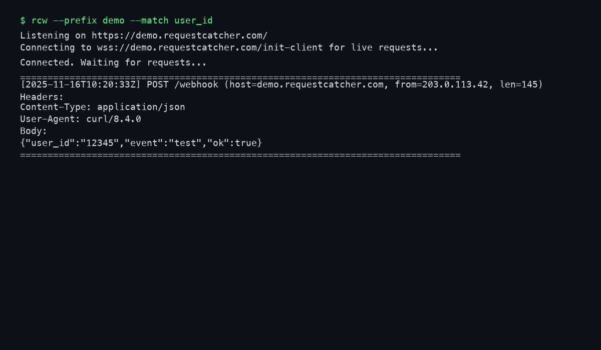

# RequestCatcher Wrapper

一个简单的 CLI，用来包装 [requestcatcher.com](https://requestcatcher.com/) 并更可靠地观测回调请求（避免浏览器后台标签页不再刷新的问题）。仓库地址：

https://github.com/n-WN/requestcatcher-wrapper

示例运行界面：



## 安装方式

使用 uv 安装（推荐）：

```bash
uv pip install requestcatcher-wrapper
```

或作为本地包安装（开发模式）：

```bash
uv pip install -e .
```

也可以直接使用 pip：

```bash
pip install requestcatcher-wrapper
```

## 使用方式（命令行）

默认使用随机前缀：

```bash
rcw
```

输出中会显示类似：

```text
Listening on https://abcd1234.requestcatcher.com/
Connecting to wss://abcd1234.requestcatcher.com/init-client for live requests...
```

把你的 webhook / HTTP 客户端指向 `https://abcd1234.requestcatcher.com/` 即可，CLI 会实时打印所有新来的请求。

指定固定前缀：

```bash
rcw --prefix mytest
```

或者：

```bash
rcw -p mytest
```

随机前缀长度可调（默认 8）：

```bash
rcw --length 12
```

高亮匹配的文本（可选）：

```bash
rcw --match user_id
```

会在终端输出中对所有包含 `user_id` 的位置（路径、头、body 等）做红色高亮，便于在大量请求里快速定位关键信息。匹配大小写不敏感。

后台运行并写入日志（推荐配合 `&` 使用）：

```bash
rcw --background --prefix mytest --log-file mytest.log
```

前台只会输出一次关键信息（监听地址 + 日志文件路径等），所有请求详情都会写入 `mytest.log`，可以用 `tail -f mytest.log` 实时查看，适合放在后台长期运行。

## 开发经验 & 设计思路

- requestcatcher 的实现是通过 WebSocket 将新请求广播给所有连接到 `/init-client` 的客户端，而不是提供传统的 HTTP 拉取接口；因此 CLI 直接连 `wss://<prefix>.requestcatcher.com/init-client`，只要连接不断就能实时收到数据。
- 同一个前缀（子域名）可以有多个 WebSocket 客户端同时在线，服务端会向所有客户端广播新请求；关键是「前缀要一致」，否则不同前缀是完全隔离的房间。
- requestcatcher 会对每个 HTTP 请求生成一个 `CaughtRequest` 对象，序列化成 JSON 发给前端/客户端，字段包括时间、方法、路径、头、body、raw_request 等；CLI 只做轻量格式化，尽量保持原始信息。
- 浏览器标签在后台时可能减弱 WebSocket 活跃度或节流定时器，所以前端页面放后台可能出现“不再实时更新”的体验；用常驻的 CLI 连接则可以绕过浏览器的节流机制，更稳定。
- 为了方便调试，CLI 默认生成随机前缀，避免和浏览器里已经开的旧房间冲突；如果需要和浏览器页面共同观测，则在 CLI 中用 `--prefix` 指定同一个前缀，浏览器和 CLI 会看到完全相同的请求流。
- 输出上优先打印请求的时间、方法、路径、来源 IP 和 Content-Length，并附带头和 body；body 过长时会截断，适合在终端中直接查看 webhook 请求内容。
